<!-- _class: cover_b -->
<!-- _footer: "" -->
<!-- _paginate: "" -->

# <!-- fit --> ISSCC 2026 Paper Discussion

###### A 0.24mJ/Frame Quadratic Interpolation 4DGS Processor

Speaker Qihan Ding
<small>dingqh2025@shanghaitech.edu.cn</small>

---

## Contents
<!-- _class: trans -->
<!-- _footer: "" -->
<!-- _paginate: "" -->

---

## Contents
<!-- _class: toc_a -->
<!-- _header: "Contents" -->
<!-- _footer: "" -->
<!-- _paginate: "" -->

- [4DGS 工作机制](#chapter-1)
- [研究背景与三大挑战](#chapter-2)
- [芯片总体架构](#chapter-3)
- [AQFI：二次插值帧生成](#chapter-4)
- [FROC：递归透明度计算](#chapter-5)
- [TAPR：树状并行像素渲染](#chapter-6)
- [实验结果与总结](#chapter-7)

---
<!-- _class: toc_b -->
<!-- _header: Contents  -->
<!-- _footer: "" -->
<!-- _paginate: "" -->

- [4DGS 工作机制](#chapter-1)
- [研究背景与三大挑战](#chapter-2)
- [芯片总体架构](#chapter-3)
- [AQFI：二次插值帧生成](#chapter-4)
- [FROC：递归透明度计算](#chapter-5)
- [TAPR：树状并行像素渲染](#chapter-6)
- [实验结果与总结](#chapter-7)
---

## Chapter 1
### 4DGS 工作机制
<!-- _class: trans -->
<!-- _footer: "" -->
<!-- _paginate: "" -->

---

## 1. 4DGS：从静态 3DGS 到动态 4DGS
<!-- _class: smalltext -->

- `3DGS` 本质上是静态场景表示：每个 Gaussian 的位置、形状、颜色和不透明度在渲染时默认不随时间变化。 如果把动态视频直接拆成每个时间戳一套独立 `3DGS`，存储和训练成本会随序列长度线性增长，很快失去可扩展性。
- `4DGS` 的核心思路是只维护一套规范状态下的 `canonical 3D Gaussians G`，再引入一个随时间工作的形变场网络 `F(G, t)`。
- 这样在任意时刻 `t`，系统都可以把静态 Gaussian 变形成该时刻对应的 `G'(t)`，再交给后端 splatting 渲染。
- 于是 `4DGS` 不是“为每一帧存一份场景”，而是“用一套基础高斯 + 一个时空形变函数”来生成整段动态场景。

---

## 2. 4DGS：HexPlane 时空编码

- 给定一个 Gaussian 的中心 `(x, y, z)` 和目标时间 `t`，`4DGS` 不直接查询完整的 4D 体素网格，而是把时空信息因子化到 6 个二维平面中。 这 6 个平面分别是 `(x,y)`、`(x,z)`、`(y,z)`、`(x,t)`、`(y,t)`、`(z,t)`：前三个描述空间结构，后三个描述随时间变化的动态信息。
- 系统在每个平面上做双线性插值，得到局部时空特征后再拼接起来，送入一个微型 `MLP` `φa` 进行聚合编码。这样做的关键价值是避免直接维护高成本的 4D 网格，同时依然保留“空间关系 + 时间变化”的联合表达能力。
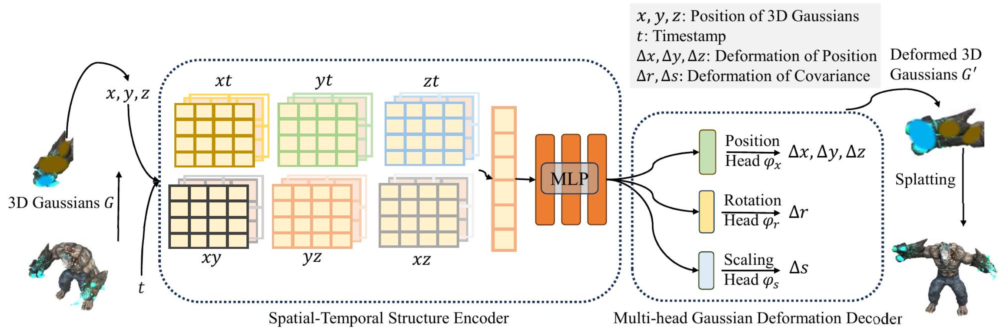

---

## Chapter 2
### 研究背景与三大挑战
<!-- _class: trans -->
<!-- _footer: "" -->
<!-- _paginate: "" -->

---

## 3. 研究背景：4DGS 渲染主循环
<!-- _class: cols-2-64 smalltext -->

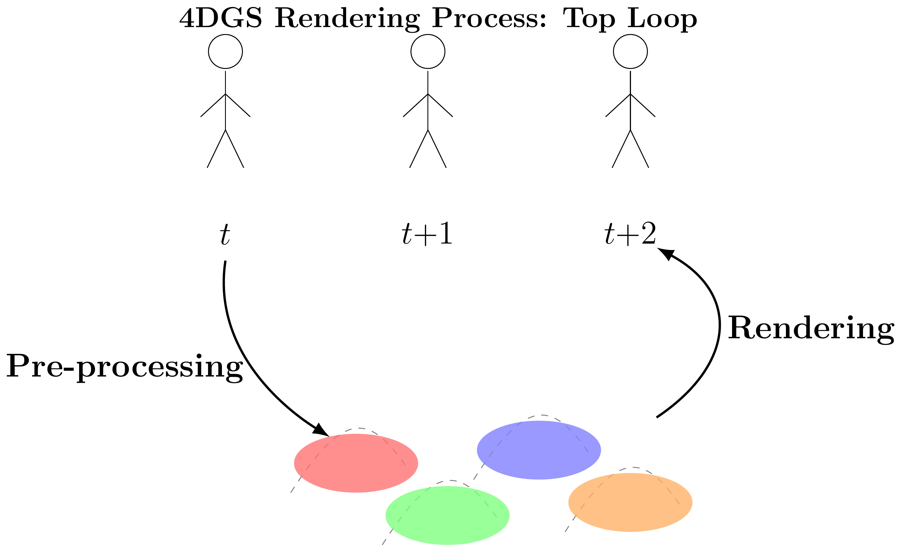

- `4DGS` 渲染面对的是连续时间序列，而不是单张静态图像，因此系统要持续处理 `t`、`t+1`、`t+2` 等相邻帧。
- 从整体流程看，前半段负责根据时序信息生成高斯参数，后半段负责把这些参数映射到像素空间并完成颜色累积。

---

## 4. 研究背景：预处理如何生成 2DGS 参数
<!-- _class: cols-2 -->

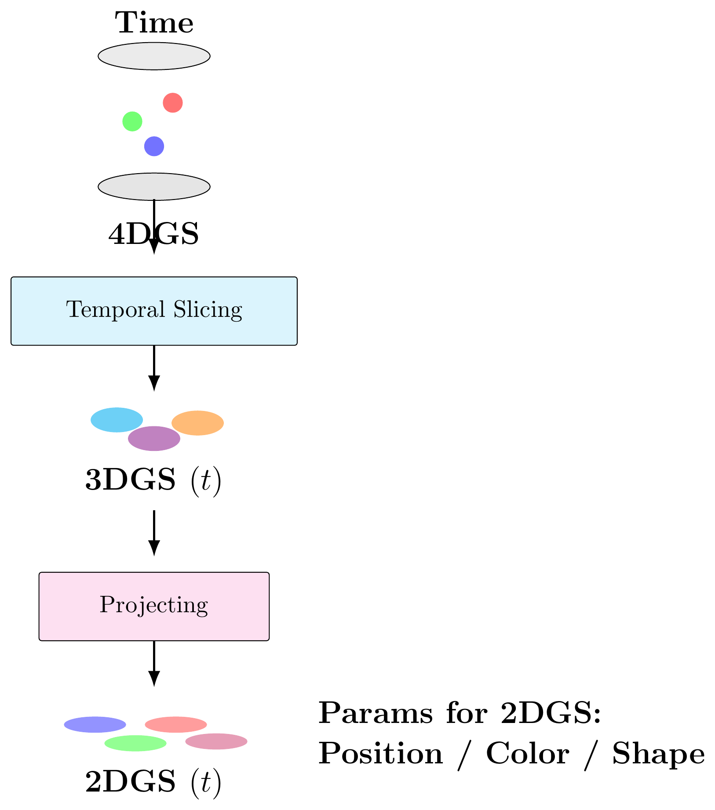

- 动态 `4DGS` 数据首先沿时间维查询，`MLP` 解码一个拼接的特征向量得到每个时刻对应的 `3DGS` 表示。 随后系统把三维高斯投影到当前视角，生成 `2DGS` 参数。
- 这意味着每一帧进入像素渲染前，都要先完成一轮非平凡的参数生成与变换。
- 如果帧间参数不能高效复用，预处理阶段本身就会成为整条渲染链路的第一类瓶颈，这一瓶颈主要由 `AQFI` 来优化。 本文标题主要和这一模块相关，和后面两位不相干。

---

## 5. 研究背景：像素渲染计算流程
<!-- _class: cols-2-46 smalltext -->

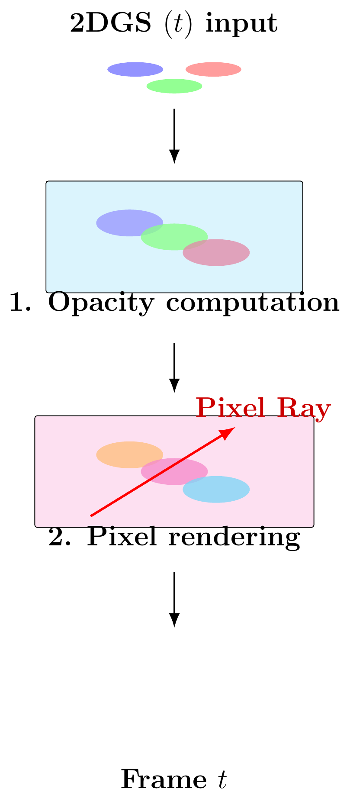

- `2DGS` 参数进入渲染阶段后，首先要完成像素透明度计算，再沿光线方向进行颜色和透射率累积。
- 这个阶段的输入已经是像素级数据流，因此运算量会随着分辨率和高斯数量迅速增长。
- 由于透明度和颜色更新之间存在前后依赖，导致很多计算并不能天然并行展开。最直接的两点是，透明度计算过程有大量重复、光线计算并行性低，所以后续两项优化 `FROC` 和 `TAPR`，本质上都在解决以上这些渲染内核内部的冗余与依赖问题。

---

## 6. 研究背景：挑战一：跨帧参数难复用
<!-- _class: cols-2-64 smalltext -->

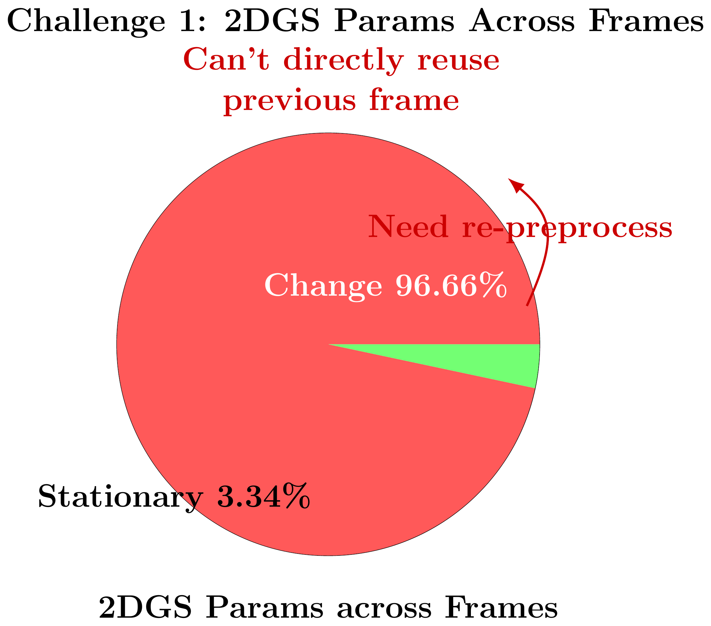

- 对动态场景而言，相邻帧之间的 `2DGS` 参数往往变化明显，前一帧结果不能直接拿到下一帧继续使用。
- 图中的统计结果表明，大多数参数在跨帧后都发生了变化，因此系统不得不频繁重新预处理。
- 这会带来额外的时间和能耗开销，也正是 `AQFI` 试图缓解的问题来源。
- 论文的第一个核心思想，就是用低成本插值近似替代高成本逐帧重算。

---

## 7. 研究背景：挑战一：内存访问开销
<!-- _class: cols-2-64 smalltext -->

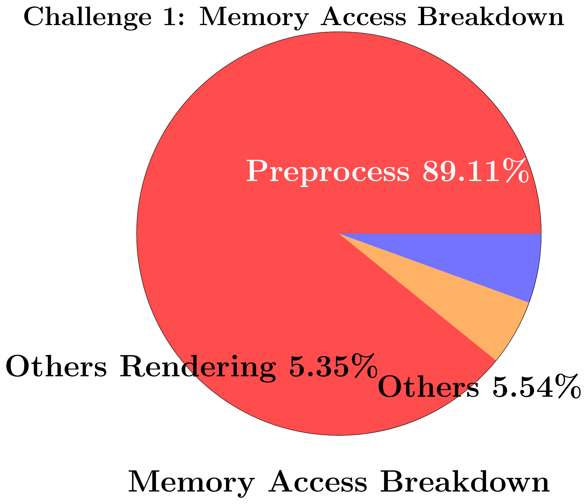

- 在相机移动的情况下，基于球谐函数的视角相关颜色会发生变化。
- 这意味着颜色的计算也具有很强的视角依赖性。
- 重新计算所有像素的颜色会带来巨大的预处理开销，相应地也会增加内存访问的次数。

---

## 8. 研究背景：挑战二：公式展开与显式冗余
<!-- _class: cols-2-64 smalltext -->

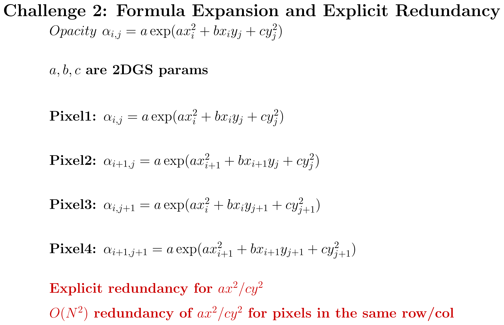

- 像素透明度通常写成带指数项的二维表达式，其中同一行和同一列像素会反复出现相似子项。
- 如果直接按公式逐像素展开，那么很多 `ax^2`、`cy^2` 一类的部分会被重复计算。
- 这种冗余不是算法必须付出的代价，而是计算顺序没有被重新组织好。
- 因此 `FROC` 的目标就是把显式重复项改写成可递归、可复用的计算形式。

---

## 9. 研究背景：挑战二：交叉项的隐式冗余
<!-- _class: cols-3 smalltext -->

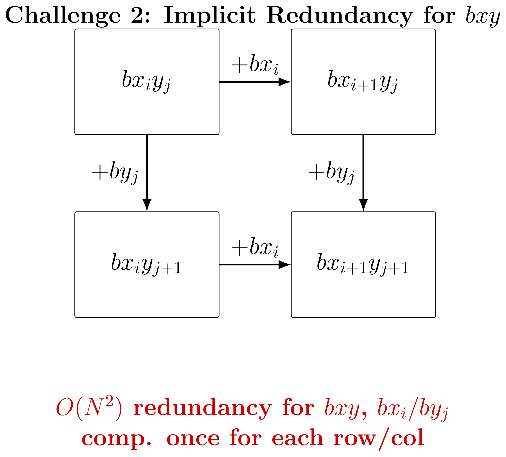

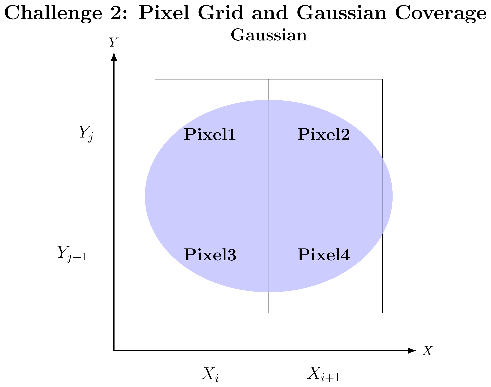

- 将透明度公式在相邻像素上展开，我们可以观察到显式的计算冗余。 例如在 Pixel 1 的计算中，包含了大量基础的乘加和指数运算。这些运算在相邻像素中会以相似的形式重复出现。
- 移动到相邻的 Pixel 2，公式中的某些如涉及 y 坐标的项保持不变。如果逐像素独立计算，这部分不变量将被重复计算。这为我们通过沿行/列复用计算结果提供了理论依据。

---

## 10. 研究背景：挑战二：计算量细分
<!-- _class: cols-3 smalltext -->

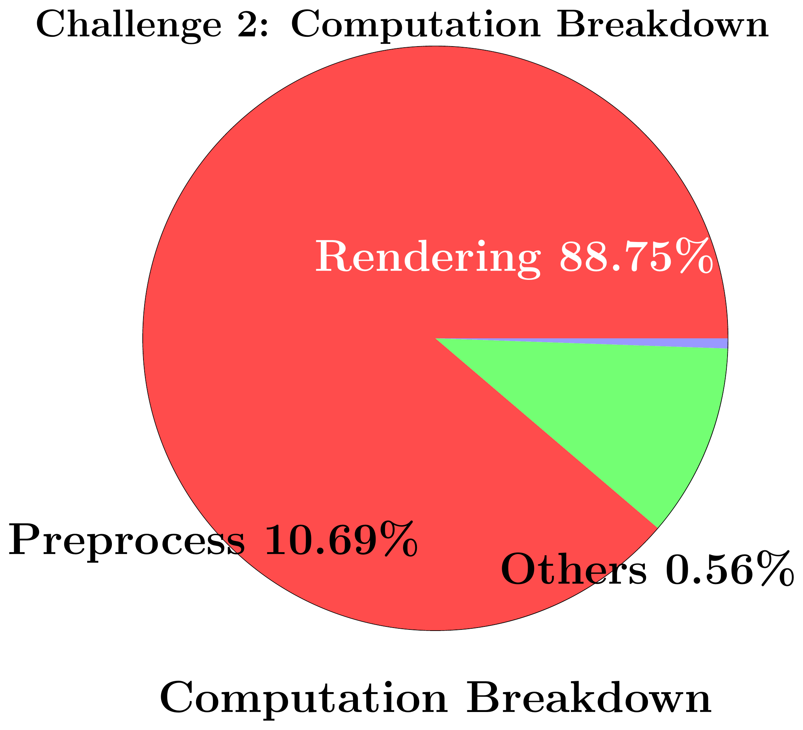

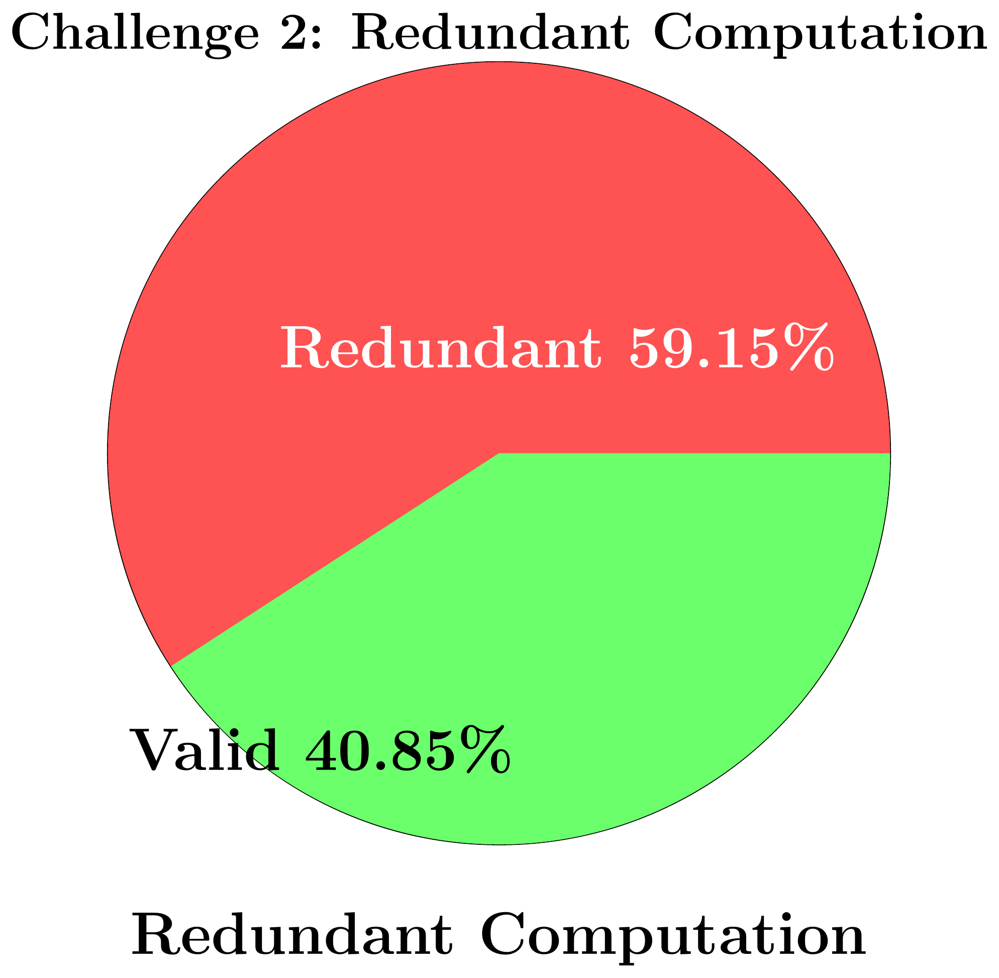

- 进一步扩展到更多相邻像素，这种显式冗余呈现出 O(N^2) 的增长趋势。 特别是在高分辨率渲染下，这种冗余导致的性能损失不可忽视。`FROC` 正是基于这一观察，提出了递归的计算复用方法。

---

## 11. 研究背景：挑战三：像素渲染串行依赖
<!-- _class: cols-2-64 smalltext -->

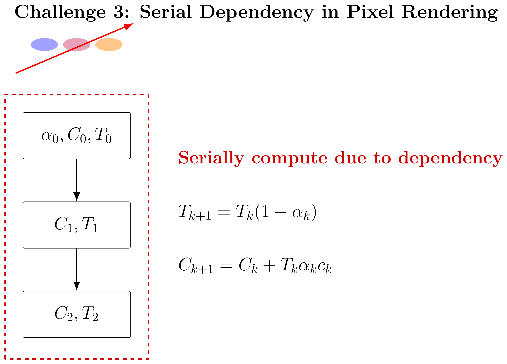

- 在传统像素渲染中，当前步的透射率和颜色更新依赖上一层高斯的累计结果。
- 这种链式依赖会把多个像素或多个高斯的处理压成串行流程，限制 `PE` 阵列的有效利用率。即使硬件上布置了更多算力单元，也会因为等待前序结果而出现空闲。
- `TAPR` 的切入点就是重构这种线性依赖，把它改写成更适合并行归约的树状结构。

---

## 12. 研究背景：挑战三：流水线时序与空闲等待
<!-- _class: cols-2-64 smalltext -->

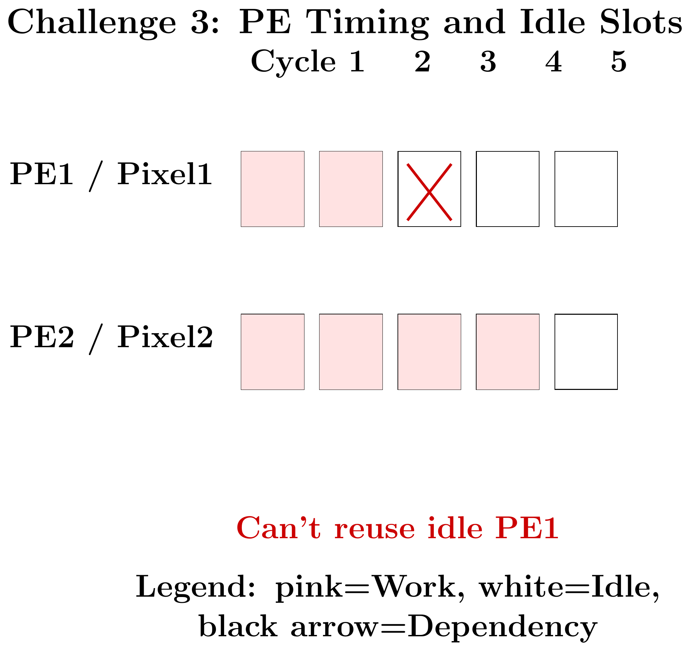

- 由于前后的 Alpha 混合依赖，像素渲染必须按深度顺序串行计算。 这种严格的依赖关系使得我们难以将计算任务分配给多个 `PE`。导致在处理深层高斯重叠时，硬件利用率严重下降。

---

## 13. 研究背景：挑战三：处理单元利用率极低
<!-- _class: cols-2-64 smalltext -->

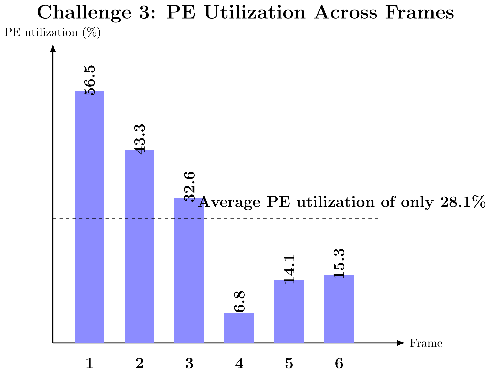

- 透射率 T_k+1 的更新公式明确展示了对前序状态 T_k 的依赖。 每一步都需要基于前一步的结果和当前的透明度进行乘法。这构成了串行计算路径中的关键一环。

---

## 14. 研究背景：挑战三：工作负载分布极不均衡
<!-- _class: cols-2-64 smalltext -->

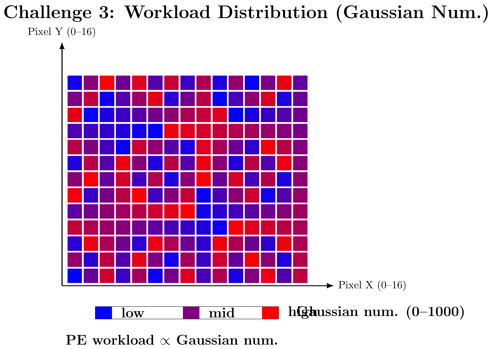

- 颜色 C_k+1 的累积同样依赖于当前的透射率和颜色属性。 前序计算的延迟会直接阻塞当前层级的颜色更新。打破这种依赖是实现高吞吐并行渲染的关键。

---

## 15. 研究背景：三大挑战总览

- 综上所述，动态 `4DGS` 渲染面临着跨帧参数更新、透明度计算冗余和渲染串行依赖三大挑战。
- 这三个挑战贯穿了从预处理到像素渲染的整个数据通路。
- 本论文提出的架构正是为了系统性地解决这三个核心问题。

---

## Chapter 3
### 芯片总体架构
<!-- _class: trans -->
<!-- _footer: "" -->
<!-- _paginate: "" -->

---

## 16. 芯片总体架构
<!-- _class: cols-2-73 smalltext -->

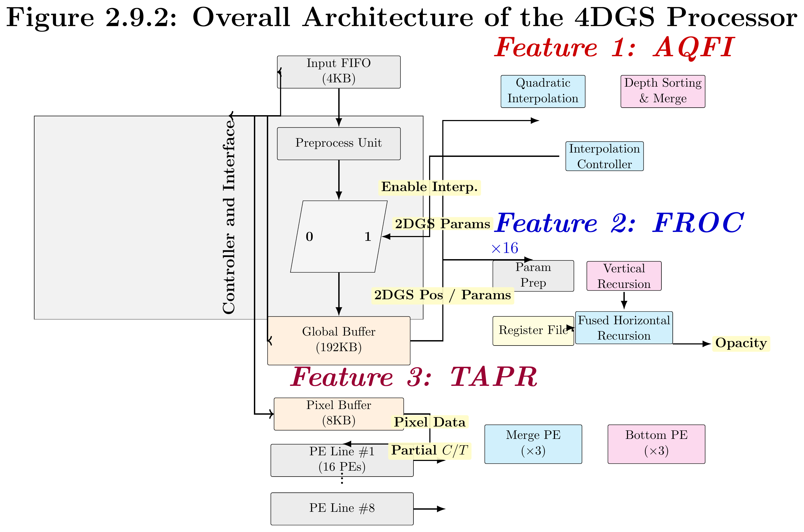

- 整个处理器由 `Preprocess Core`、`Pixel Rendering Core`、多条 `PE Line` 和片上 `Pixel Buffer` 组成。
- 数据流上先完成高斯参数和时域信息的生成，再进入像素渲染核心进行透明度与颜色累积。
- 三个特性模块分别嵌入不同层级：`AQFI` 面向帧插值预处理，`FROC` 面向透明度递归复用，`TAPR` 面向并行像素渲染。

---

## 17. 芯片总体架构：预处理核心
<!-- _class: cols-2-73 smalltext -->

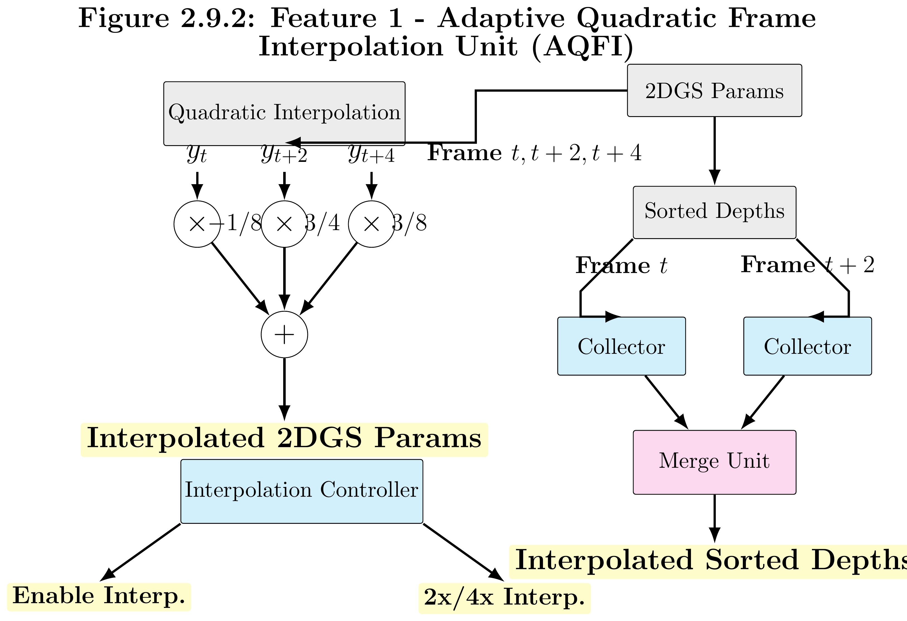

- 预处理核心负责将 `4DGS` 数据转化为适合渲染的 `2DGS` 参数。 它包含了处理时空信息的逻辑，以及执行几何变换的算术单元。`AQFI` 模块被集成在此处，用于加速参数的生成。

---

## 18. 芯片总体架构：像素渲染核心
<!-- _class: cols-2-64 smalltext -->

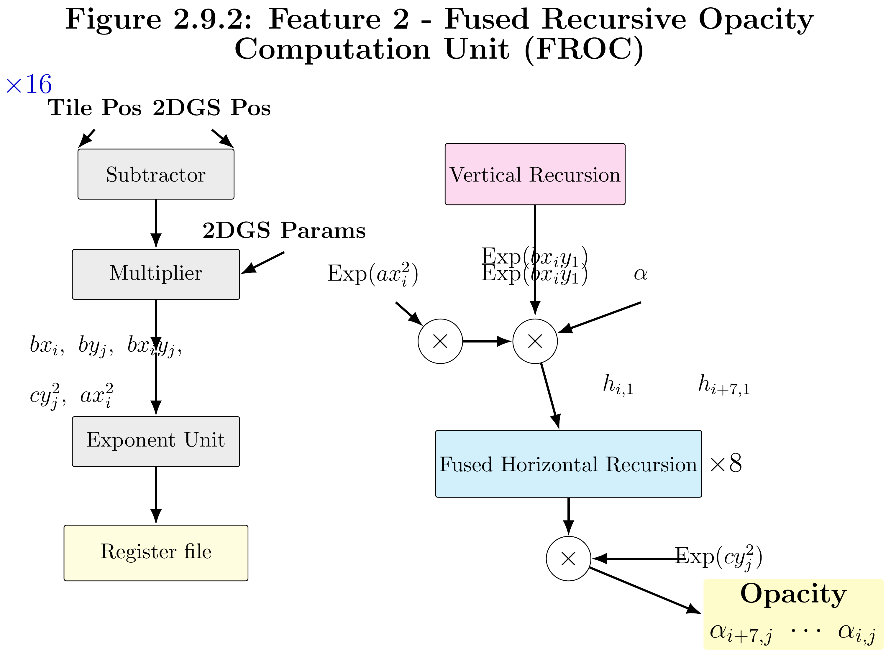

- 像素渲染核心是芯片的算力重镇，负责执行高强度的透明度和颜色计算。 它通过多条 `PE Line` 的协同工作来提升整体吞吐量。`FROC` 和 `TAPR` 模块被部署在此核心中，以打破计算瓶颈。

---
## 19. 芯片总体架构：像素渲染核心
<!-- _class: cols-2-64 smalltext -->

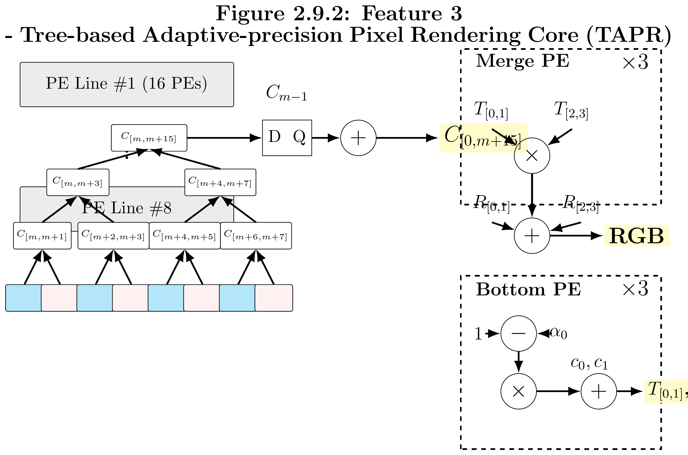

- 像素渲染核心是芯片的算力重镇，负责执行高强度的透明度和颜色计算。 它通过多条 `PE Line` 的协同工作来提升整体吞吐量。`FROC` 和 `TAPR` 模块被部署在此核心中，以打破计算瓶颈。

---

## Chapter 4
### AQFI：二次插值帧生成
<!-- _class: trans -->
<!-- _footer: "" -->
<!-- _paginate: "" -->

---

## 20. AQFI：二次插值生成 2DGS 参数
<!-- _class: cols-2-64 smalltext -->

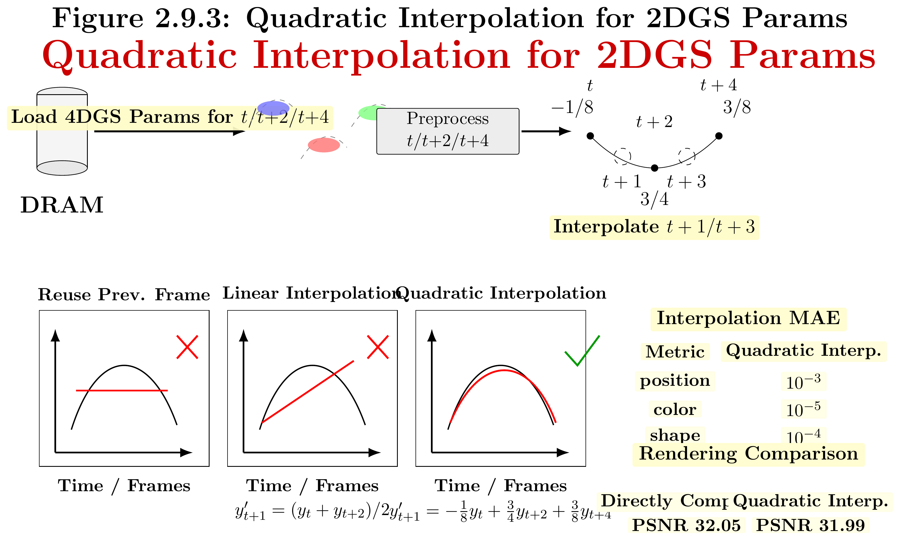

- `AQFI` 直接加载 `t / t+2 / t+4` 三个关键帧参数，再插值生成 `t+1 / t+3`。
- 左下角把三种方案并列比较：直接复用上一帧会明显失真，线性插值仍然偏离真实轨迹，而二次插值最接近实际变化曲线。
- 右下角的 `MAE` 和渲染结果说明，这种二次插值在 `position / color / shape` 上误差很小，最终 `PSNR` 也几乎不掉。

---

## 21. AQFI：自适应插值比率
<!-- _class: cols-2-64 smalltext -->

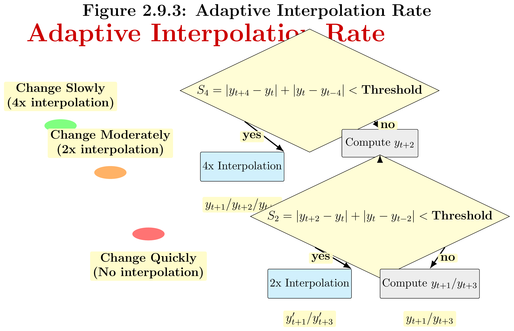

- `AQFI` 不是固定倍率插值，而是根据运动强度自适应选择 `4x`、`2x` 或不插值。
- 上层阈值 `S4` 先判断跨更大时间间隔的变化是否足够平缓；如果变化很小，就直接采用 `4x interpolation`，一次生成更多中间帧。
- 如果变化没有那么平稳，就继续用下层阈值 `S2` 判断是否还能做 `2x interpolation`；只有在变化剧烈时，系统才退回到直接计算对应时刻参数。

---

## 22. AQFI：深度排序的归并插帧
<!-- _class: cols-2-64 smalltext -->

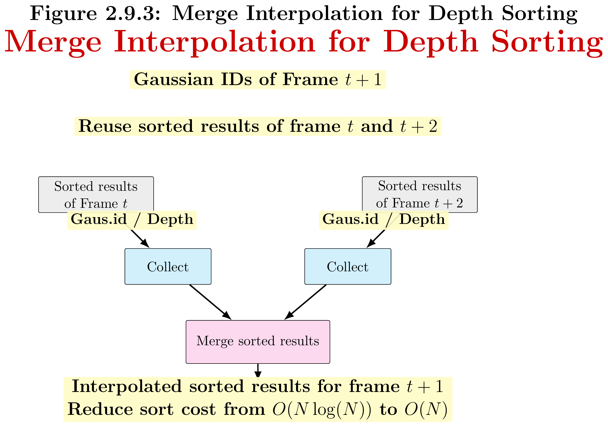

- 除了高斯参数本身，`AQFI` 还进一步优化了中间帧的深度排序过程，不再对 `t+1` 这一帧从头执行完整排序。
- 图中的做法是直接复用相邻关键帧 `t` 和 `t+2` 已经排好序的 `Gaussian ID` / `Depth` 结果，先收集两侧候选序列，再做一次归并。
- 由于相邻帧之间的深度顺序通常变化有限，这种 `merge interpolation` 可以较稳定地得到 `t+1` 的近似排序结果。
- 它把排序复杂度从传统的 `O(N log N)` 降到近似线性的 `O(N)`，进一步降低了前处理阶段的时间和能耗开销。

---

## 23. AQFI：硬件映射与性能收益
<!-- _class: cols-2-64 smalltext -->

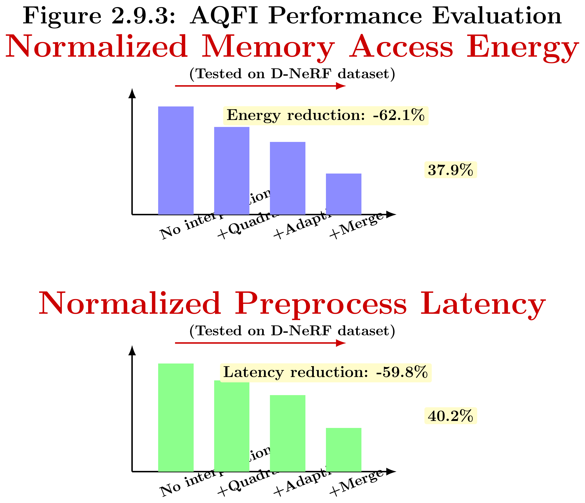

- `AQFI` 不只是算法近似，还被实现成专用硬件单元，用于把插值路径直接融入芯片前端流程。
- 性能评估进一步表明：在 `D-NeRF` 数据集上，`AQFI` 能通过精简访存，显著提升吞吐，降低每帧的前处理成本。
- `AQFI` 以较小精度代价换取了大幅的前端效率提升，是整颗芯片性能提升的第一步。

---

## Chapter 5
### FROC：递归透明度计算
<!-- _class: trans -->
<!-- _footer: "" -->
<!-- _paginate: "" -->

---

## 24. FROC：递归透明度计算
<!-- _class: cols-2-64 smalltext -->

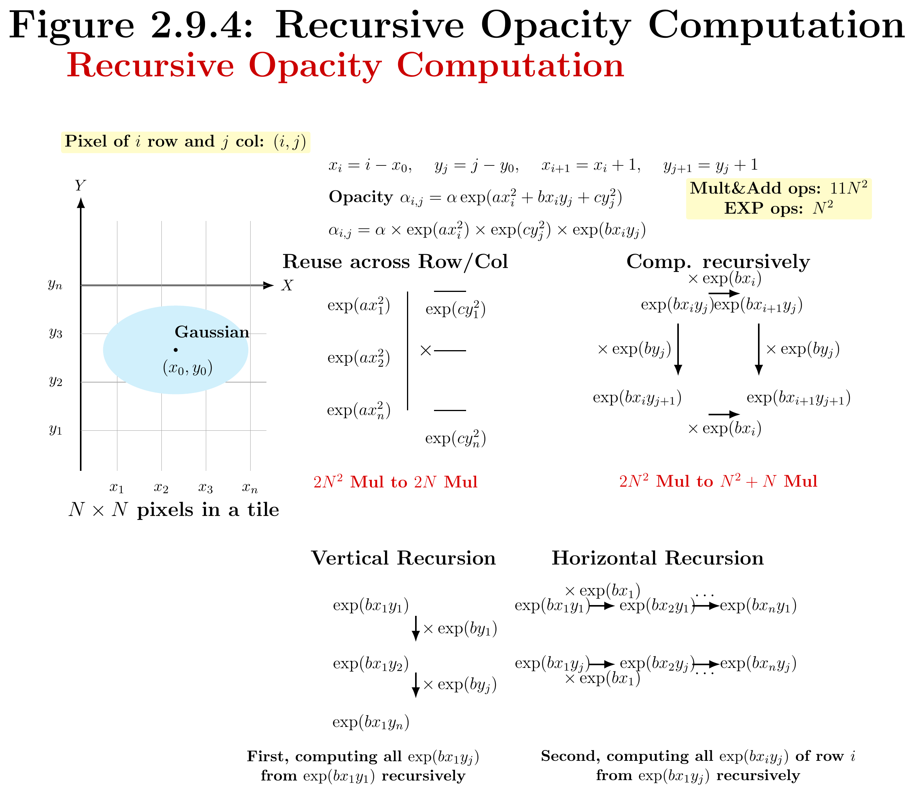

- `FROC` 针对的是像素渲染中最核心的透明度计算链，它利用指数项之间的结构关系，避免重复展开同类计算。图中从原始公式出发，逐步拆分为可沿行和列递归复用的形式，把原本高成本的指数求值改造成低成本的递推。

---

## 25. FROC：公式推导过程
<!-- _class: cols-2-64 smalltext -->

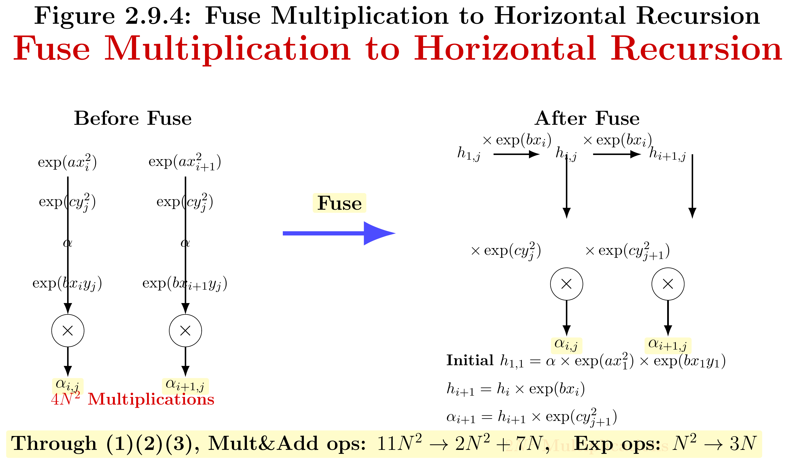

- 本页展示了 `FROC` 是如何从原始的高斯透明度公式一步步推导而来的。 通过提取公共项和构建递推关系，将乘法和指数运算转换为简单的加法和移位。这种数学上的等价变换是硬件高效实现的基础。

---

## 26. FROC：性能评估结果
<!-- _class: cols-2-64 smalltext -->

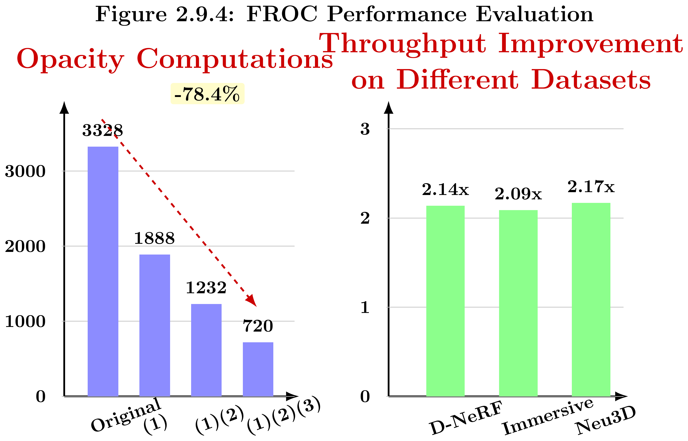

- 性能评估对比了采用 `FROC` 前后的计算量和延迟。 可以看到，乘法和指数运算的数量显著减少，整体吞吐量大幅提升。说明 `FROC` 在降低计算复杂度的同时，也降低了动态功耗。

---

## 27. FROC：融合递归硬件单元
<!-- _class: cols-2-64 smalltext -->

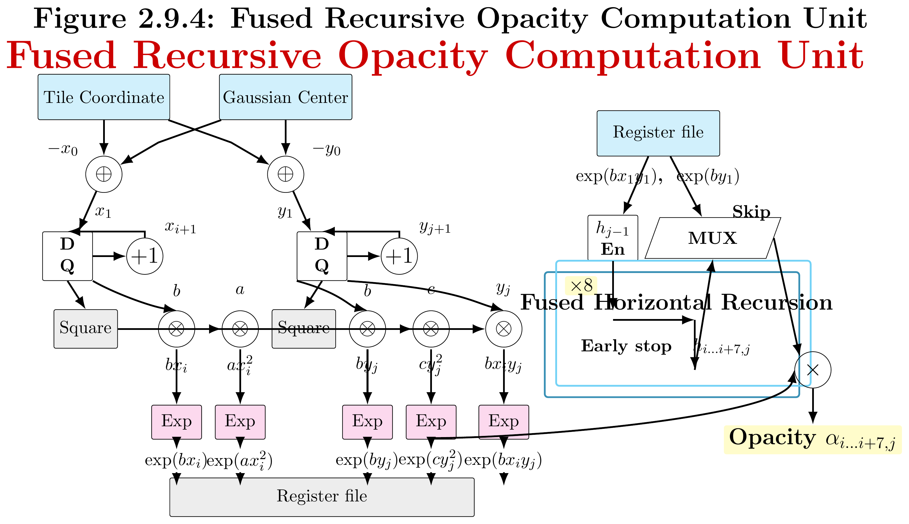

- `FROC` 通过融合递归操作，把透明度递推和颜色累积尽量收敛到更短的关键路径中。

---

## Chapter 6
### TAPR：树状并行像素渲染
<!-- _class: trans -->
<!-- _footer: "" -->
<!-- _paginate: "" -->

---

## 28. TAPR：树状并行像素渲染
<!-- _class: cols-2-64 smalltext -->

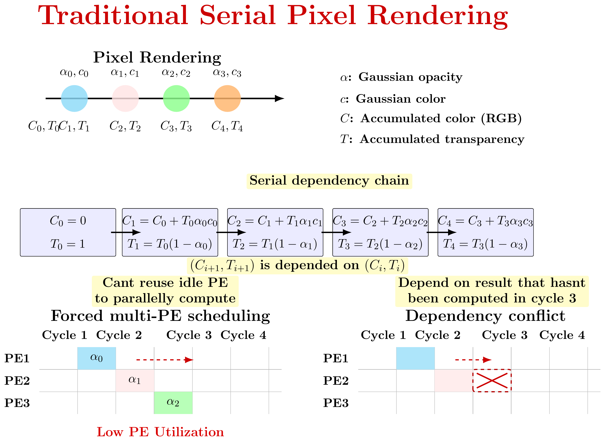

- 传统串行像素渲染存在强数据依赖，导致多个 `PE` 即使被分配出来，也常常处于空闲等待状态。
- `TAPR` 用树状合并结构重写颜色与透明度累积过程，把原先线性的依赖链改造成可分治、可并行的二叉树归约。
- 图中展示了 `Bottom PE` 与 `Merge PE` 的层次关系，本质上是在用更高的结构并行性换取更高的 `PE` 利用率。
- 底部利用率柱状图说明，这种结构性改写能在多个数据集上显著优于串行渲染。

---

## 29. TAPR：处理单元利用率：PE Utilization
<!-- _class: cols-2-64 smalltext -->

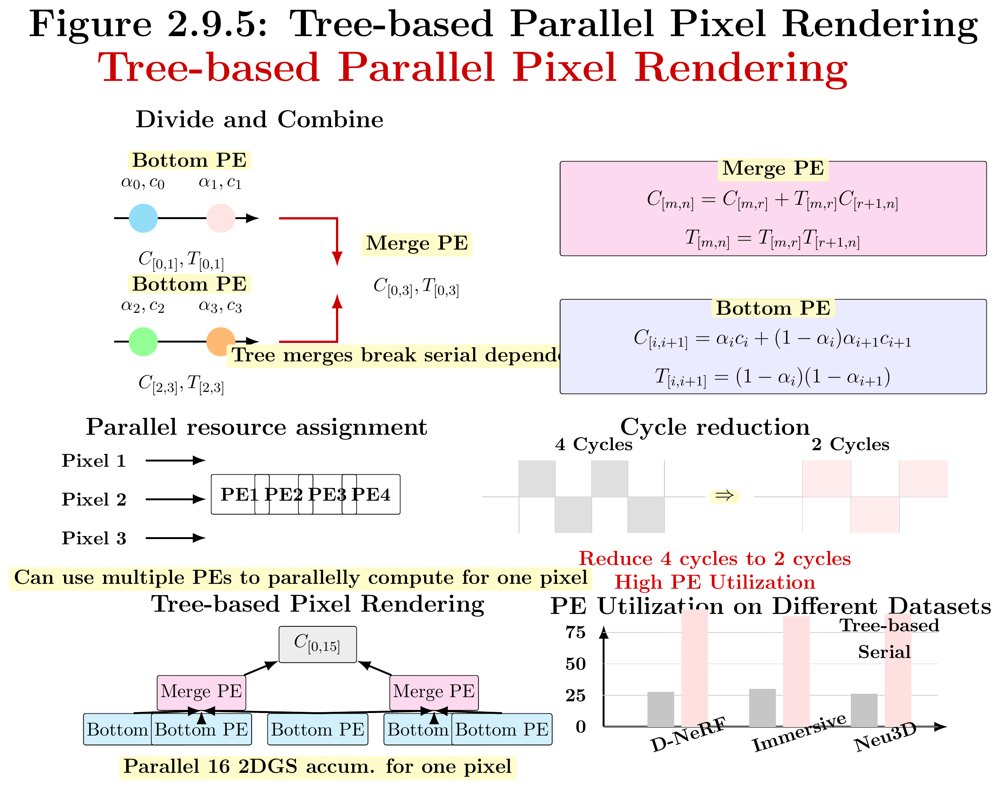

- 采用树状结构后，`PE` 的利用率得到了显著的改善。
- 空闲等待的时间大幅缩短，更多的 `PE` 能够同时处于工作状态。
- 这种高利用率直接转化为更高的帧率和更低的渲染延迟。

---

## 30. TAPR：自适应精度与可重构硬件
<!-- _class: cols-2-64 smalltext -->

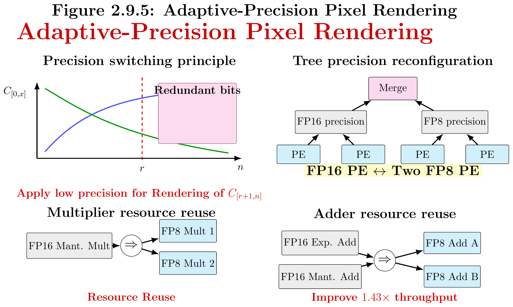

- `TAPR` 不仅引入树状并行，还观察到后期累积项往往接近零，因此可以在后段计算中切换到更低精度。
- 右侧硬件图展示了 `BF16 PE Line` 与 `FP8 PE Line` 的重构关系，本质是把同一套资源在不同精度模式下复用。这使芯片能够根据计算阶段动态平衡精度与吞吐，在保证整体画质的同时进一步提升每周期有效工作量。

---

## 31. TAPR：数据类型重构详情
<!-- _class: cols-2-64 smalltext -->

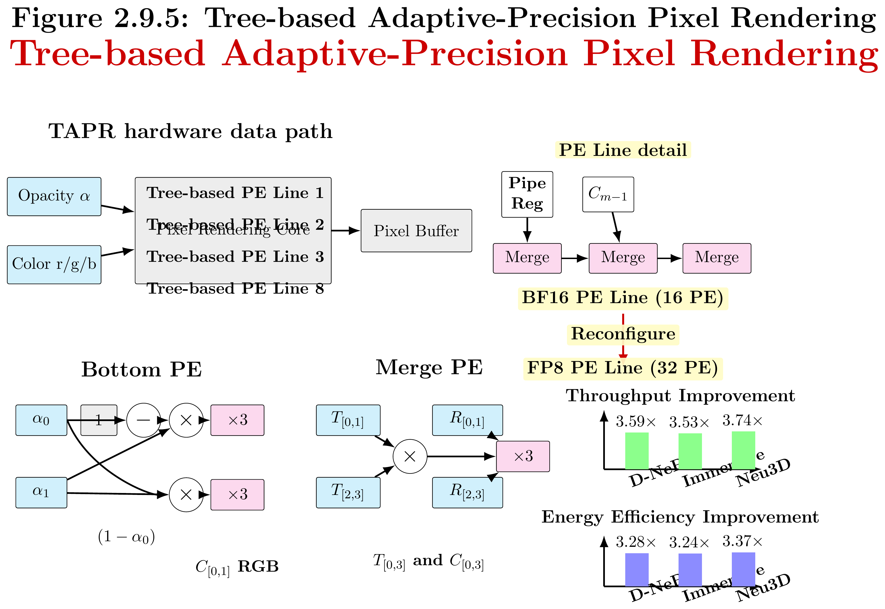

- 这一页详细说明了 `TAPR` 如何在 `BF16` 和 `FP8` 数据类型之间进行硬件重构。
- 在渲染的不同阶段，系统可以动态切换精度以匹配数值范围的变化。
- 数据类型的重构在保证渲染质量的同时，进一步压榨了硬件的性能潜力。

---

## Chapter 7
### 实验结果与总结
<!-- _class: trans -->
<!-- _footer: "" -->
<!-- _paginate: "" -->

---

## 32. 系统级性能提升
<!-- _class: cols-2-64 smalltext -->

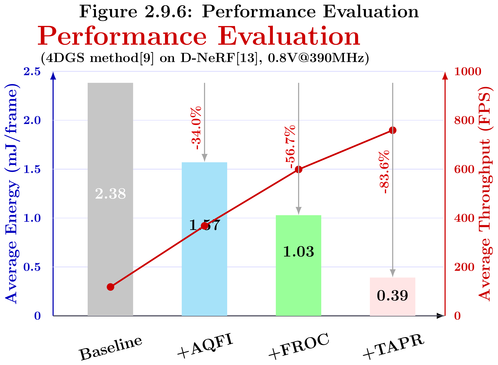

- `Baseline` 到 `+AQFI`、`+FROC`、`+TAPR`，能量持续下降，吞吐持续上升。
- 从柱状图看，平均每帧能耗由 `2.38 mJ/frame` 下降到 `0.39 mJ/frame`，说明系统优化并非局部收益，而是可叠加的。
- 从折线图看，平均吞吐随技术叠加明显上升，证明三项优化在系统级具有协同作用。

---

## 33. 与 SOTA 处理器对比
<!-- _class: cols-2-64 tinytext -->

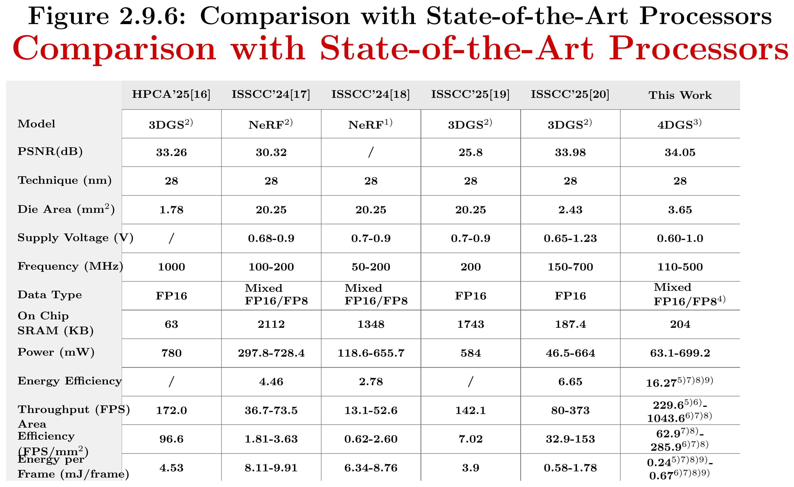

- 在同类神经渲染处理器比较中，本文工作在 `28 nm` 工艺下实现了有竞争力的面积、功耗和片上存储配置。
- 关键结果包括：最高 `16.27 TFLOPS/W` 的能效、`229.6` 到 `1043.6 FPS` 的吞吐范围，以及 `0.24 mJ/frame` 量级的能耗。
- 与多篇 `HPCA`、`ISSCC` 近年工作相比，这一设计的优势不只在单点指标，而是在画质、实时性与能效之间取得了更均衡的系统表现。

---

## 34. 与 SOTA 处理器对比：续
<!-- _class: cols-2-73 smalltext -->

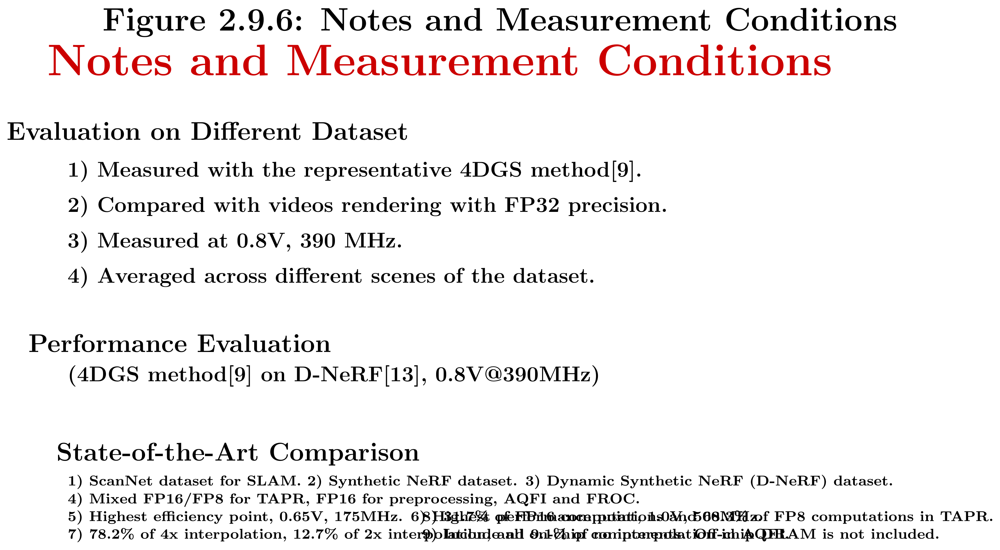

- 表格备注。

---

## 35. 汇报总结
<!-- _class: cols-2-64 smalltext -->

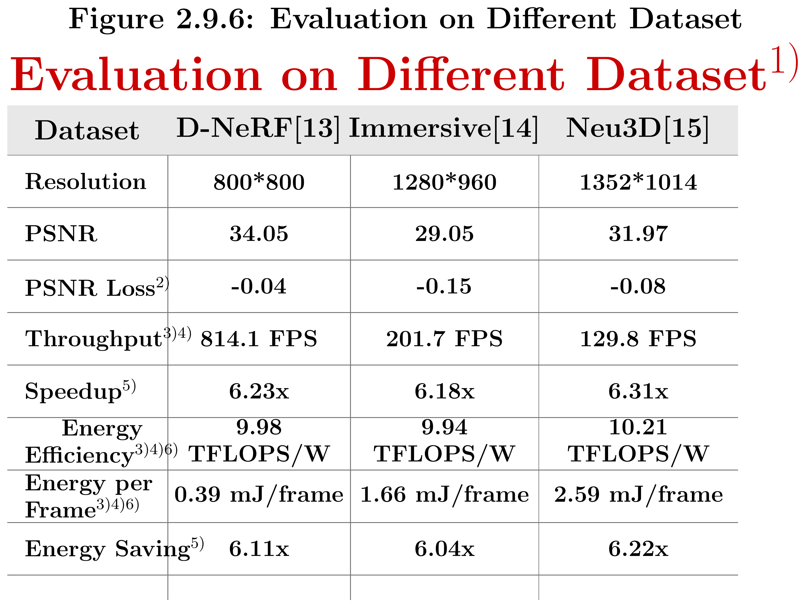

- 本文三项优化分别解决“参数生成慢”“透明度计算重”“像素渲染并行差”这三个关键问题，并最终共同作用于芯片级指标。
- 数据集实测结果表明，该处理器在 `D-NeRF`、`Immersive` 和 `Neu3D` 上都能保持较好的 `PSNR`，同时获得显著吞吐和能效收益。

---

## 36. 设计思想总结

- 本文不仅着力于紧凑的流水线设计以及老生常谈的参数复用，还特别关注“Adaptive设计”，比如自适应插帧、自适应精度渲染。
- 美中不足的是整个硬件设计过于专用，三个模块割裂感强，没有找到一些通用计算结构来供三个模块复用，不过瑕不掩瑜。

---
<!-- _class: lastpage -->
<!-- _header: "" -->
<!-- _footer: "" -->
<!-- _paginate: "" -->

###### Thank You

- 4DGS Processor
- ISSCC 2026
- ShanghaiTech

