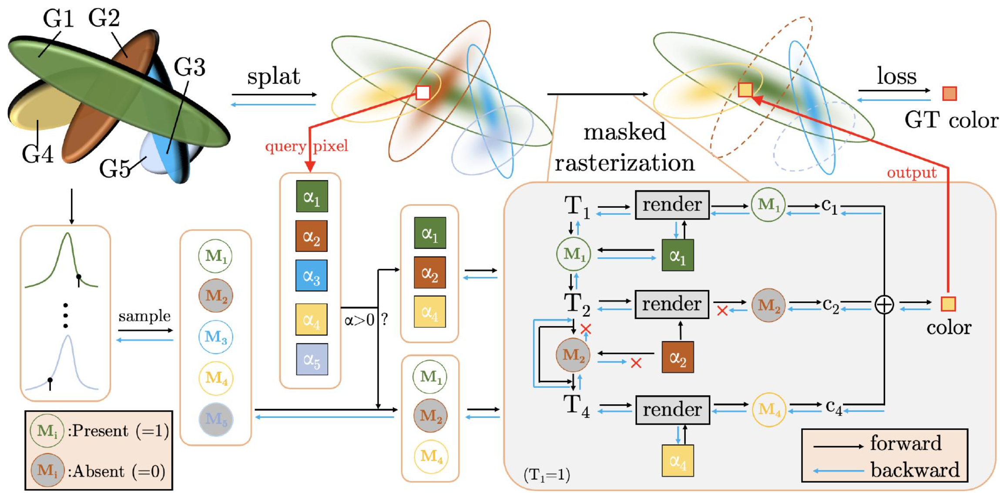

<!-- _class: cover_b -->
<!-- _paginate: "" -->

# MaskGaussian: Adaptive 3D Gaussian Representation from Probabilistic Masks

Speaker Your Name
<small>dingqh2025@shanghaitech.edu.cn</small>

---
## 1. 现有 3DGS 剪枝方法的局限性
<!-- _class: cols-2 -->

* 3DGS 在稠密化和优化过程中往往会生成数以百万计的冗余高斯基元，这不仅降低了训练和渲染速度，还导致了极高的显存消耗。

* 现有的剪枝方法（如 LightGaussian、RadSplat）通常基于某个特定训练时刻的快照，计算一个手工设计的指标并设定阈值进行硬剪枝。

* 即使是使用可学习掩码的方法如 Compact3DGS，一旦掩码将某个高斯基元移除，它就会被永久排除。这种确定性的做法没有考虑到场景剪枝后的动态演化。

* 以往的方法通常将掩码直接乘以高斯基元的透明度或缩放比例。这种做法的缺陷在于：当掩码为 0 时，该高斯的密度 $\alpha$ 也变为 0 。在 CUDA 光栅化管线中，$\alpha = 0$ 的基元会在光栅化之前被直接过滤掉（$\alpha$-filtering）。

* 被遮蔽的高斯基元**无法接收任何梯度更新**，其参数停滞不前。随着场景的演化，这些基元迅速过时，导致其存在的概率持续走低，最终在后续评估中被彻底丢弃，造成渲染质量骤降。

---
## 2. 概率存在性与掩码光栅化

---
## 2. 概率存在性与掩码光栅化

为了解决上述优化困境，MaskGaussian 提出将高斯基元建模为**概率实体（probabilistic entities）** 。

1. 算法不再永久性地移除高斯基元，而是为每个高斯基元学习一个存在概率，并在每次迭代时根据该概率进行二值采样（1，存在，或0，缺失）。
2. 为了让未被采样的基元也能感知到它们对当前场景的“潜在贡献”，MaskGaussian 没有将掩码与 $\alpha$ 绑定，而是让所有高斯基元（无论是否被掩码遮蔽）都通过 $\alpha$ 过滤，并进入光栅化阶段。
3. 掩码仅在光栅化内部的透射率衰减和颜色累积两个环节发挥作用 。这样既保证了渲染结果的正确性，又打通了反向传播的梯度流 。

---

## 3. STE & Gumbel-Softmax
<!-- _class: cols-2 -->

为了实现概率采样且保持端到端可导，MaskGaussian 将掩码生成转化为一个两类别的采样过程 。
* **参数化：** 为每个高斯基元分配 2 个可学习的掩码分数 。
* **采样瓶颈：** 标准的 $argmax$ 操作不可微；而 Compact3DGS 使用的 Straight-Through Estimator (STE) 结合阈值的方法，本质上仍是生成确定性掩码 。消融实验表明，STE 会导致网络陷入次优收敛：分数低于阈值的基元被迅速剪枝，场景无法重新采样探索，导致渲染质量下降（Mip-NeRF360 上 PSNR 降至 27.30）。

* **Gumbel-Softmax 的引入：** 本文采用 Gumbel-Softmax 从这两个分数中进行随机采样，生成可微的二值掩码 $\mathcal{M}_i \in \{0, 1\}$ 。

* **Pros：**
1. 随机采样使得模型在训练时能够不断尝试包含或排除某些临界高斯基元，评估不同组合的效果。
2. 即使当前迭代中某高斯未被采样（$\mathcal{M}_i = 0$），由于 Gumbel-Softmax 的平滑特性和 Masked-Rasterization 提供的梯度，它仍有机会在后续迭代中调整概率并重新出现。

---
### 3. STE & Gumbel-Softmax

传统的离散采样（如 `argmax`）是一个不可微的操作。这意味着，如果我们想通过反向传播来优化生成这些离散决策的参数（比如 MaskGaussian 中生成掩码分数的参数），梯度链会在采样点处中断，无法传递回去。

我们先回顾一下 Softmax 函数。Softmax 函数将一组任意的实数值（称为 logits）转换为概率分布，使得所有概率之和为 1。对于一组 logits $z = [z_1, z_2, \dots, z_K]$，Softmax 函数输出的概率 $p_j$ 为：$p_j = \frac{e^{z_j}}{\sum_{k=1}^{K} e^{z_k}}$
Softmax 是可微的，但它输出的是概率分布，而不是离散的采样结果。如果直接使用 `argmax(softmax(z))` 来获得离散结果，`argmax` 依然是不可微的。

---
## 3. STE & Gumbel-Softmax
1.  **引入 Gumbel 噪声：**
    对于每个类别的 logits $z_j$，我们添加一个从标准 Gumbel 分布 ($G_j \sim \text{Gumbel}(0, 1)$) 中采样的随机噪声。Gumbel 分布是一种极值分布，其特性使其非常适合用于模拟竞争性选择。

    Gumbel 噪声的引入使得 `argmax` 操作可以通过一个连续的、可微的近似来替代。具体来说，对于一个分类分布，我们可以通过 `argmax(logits + Gumbel_noise)` 来实现采样，这被称为 **Gumbel Max Trick**。但 `argmax` 仍然是不可微的。

2.  **Softmax 近似：**
    为了使 `argmax` 操作可微，Gumbel-Softmax 将 `argmax` 替换为带有温度参数 ($\tau$) 的 Softmax 函数。
    对于扰动后的 logits $z'_j = z_j + G_j$，Gumbel-Softmax 的输出 $y_j$ 为：$y_j = \frac{e^{(z_j + G_j)/\tau}}{\sum_{k=1}^{K} e^{(z_k + G_k)/\tau}}$
    这里的 $y = [y_1, y_2, \dots, y_K]$ 是一个**连续的、近似的、可微分的**概率向量。它类似于 Softmax 输出，但包含了 Gumbel 噪声的影响。

---
## 3. STE & Gumbel-Softmax
3.  **温度参数 ($\tau$) 的作用：**
    *   当 $\tau \to \infty$ 时，Gumbel-Softmax 的输出趋近于均匀分布，即所有 $y_j$ 都接近 $1/K$。
    *   当 $\tau \to 0$ 时，Gumbel-Softmax 的输出趋近于 one-hot 向量，其中概率最大的那个 $y_j$ 趋近于 1，其他趋近于 0。这使得它在行为上近似于 `argmax` 操作，但仍然保持可微性。
    在实际应用中，通常从较大的 $\tau$ 开始，并在训练过程中逐渐退火到较小的值，以便在训练初期探索更多可能性，后期收敛到更确定的离散选择。

4.  **重参数化技巧：**
    Gumbel-Softmax 之所以能反向传播，是因为它使用了重参数化技巧。传统的采样操作是随机的，导致梯度无法通过。重参数化技巧通过将随机性从采样操作本身转移到**一个可微分的函数输入**中，从而使得梯度能够正常计算。在 Gumbel-Softmax 中，Gumbel 噪声 $G_j$ 是独立于模型参数的随机变量。我们通过 Softmax 函数将 $z_j + G_j$ 转换为概率，而不是直接对 $G_j$ 进行采样。这样，整个采样过程变成了对 $z_j$ 和 $G_j$ 的一个确定性函数，其中只有 $G_j$ 是随机的。当反向传播时，梯度可以流经 Softmax 函数，并最终更新生成 logits $z_j$ 的模型参数。

---
## 4. Masked-Rasterization 的前向传播
为了确保被遮蔽的高斯在不影响当前帧渲染颜色的同时保留梯度路径，需要将掩码 $\mathcal{M}_i$ 嵌入到传统的 $\alpha$-blending 公式中：
对于查询像素 $x$，渲染颜色 $c(x)$ 和透射率 $T_{i+1}$ 的演化公式被重写为：
$$c(x) = \sum_{i=1}^{N} \mathcal{M}_{i} \cdot c_{i} \cdot \alpha_{i} \cdot T_{i}$$
$$T_{i+1} = \mathcal{M}_{i} \cdot (1 - \alpha_{i}) \cdot T_{i} + (1 - \mathcal{M}_{i}) \cdot T_{i}$$
* **$\mathcal{M}_i = 1$：** 公式退化为标准 3DGS 的光栅化过程，基元正常贡献颜色并消耗透射率 。
* **$\mathcal{M}_i = 0$：** 该基元对颜色的贡献被强制清零，且跳过透射率消耗（$T_{i+1} = T_i$），确保渲染出的图像就像该基元被物理剪枝了一样 。

---
## 5. Masked-Rasterization 的反向传播
<!-- _class: cols-2 -->

由于所有参数都参与了前向计算图，我们可以对掩码 $\mathcal{M}_i$ 求导。定义 $b_{i+1}$ 为第 $i$ 个高斯基元背后渲染出的背景颜色：
$$b_{i+1} = \sum_{j=i+1}^{N} \mathcal{M}_{j} \cdot c_{j} \cdot \alpha_{j} \cdot T_{j}$$
此时，损失函数 $L$ 对掩码 $\mathcal{M}_i$ 的梯度公式为：
$$\frac{\partial L}{\partial \mathcal{M}_{i}} = \alpha_{i} \cdot T_{i} \cdot \frac{\partial L}{\partial c(x)} \cdot (c_{i} - b_{i+1})$$

**梯度的物理意义极其明确，由两部分构成：**
1. **影响力：$\alpha_{i} \cdot T_{i}$。** 这不仅决定了梯度的尺度，且在数学上恰好等价于传统分数剪枝法所使用的重要度指标 。
2. **颜色收益：$\frac{\partial L}{\partial c(x)} \cdot (c_{i} - b_{i+1})$。** 它衡量了使用当前基元颜色 $c_i$ 与直接暴露出其背后颜色 $b_{i+1}$ 相比，对优化方向 $\frac{\partial L}{\partial c(x)}$ 的帮助程度 。如果两者的点积为正，说明激活该基元能降低 Loss，即使它当前处于被掩蔽状态，掩码也会收到正梯度，促使其在未来迭代中增加存在的概率 。

---
## 6. 损失函数与剪枝策略
为了促使模型学习到更稀疏的表示，本文在原有的渲染损失 $L_{render}$ 基础上引入了针对掩码的正则化项：
$$L_{m} = \left( \frac{1}{N} \sum_{i=1}^{N} \mathcal{M}_{i} \right)^{2}$$
$$L = L_{render} + \lambda_{m} \cdot L_{m}$$
* 实验发现，对掩码均值使用平方损失在约束高斯基元平均数量方面，经验上优于 L1 损失 。
* 为了真正释放显存，需要执行物理删除。策略是对每个高斯基元采样 10 次，如果一次都没有被采样到，说明其存在概率已趋近于 0，则将其彻底移除 。此清理过程在每次稠密化步骤及之后的每 1000 次迭代时触发 。

---
## 7. 实验结果
<!-- _class: cols-2 -->

* 在 Mip-NeRF360、Tanks & Temples 和 Deep Blending 数据集上，平均剪枝率分别达到了 **62.4%、67.7% 和 75.3%** 。
* 帧率（FPS）相应提升了 **2.05倍、2.19倍 和 3.16倍** 。在峰值显存方面，以 `truck` 场景为例，原版 3DGS 占用 9.03GB，而 MaskGaussian 仅需 6.45GB 。

* 由于采用概率采样和 Masked-Rasterization，模型避免了对细小基元的误杀。
* 例如，在 `bicycle` 场景中，Compact3DGS 错误地剔除了轮胎气门嘴和细长的辐条，而本方法能够准确捕获并保留 ；在 `garden` 场景中，本方法同样成功保全了大量细小的植物枯须 。

**抗过拟合效应：**
* 在 Deep Blending 数据集上，MaskGaussian 的渲染质量（PSNR: 29.69）甚至超越了原版 3DGS（PSNR: 29.53）。作者将此归功于剪枝带来的正则化效应，有效缓解了显式点云极易产生的过拟合现象 。

---
<!-- _class: lastpage -->
<!-- _header: "" -->
<!-- _footer: "" -->
<!-- _paginate: "" -->

###### Thank You

- MaskGaussian
- 3DGS Pruning
- VSP Lab

